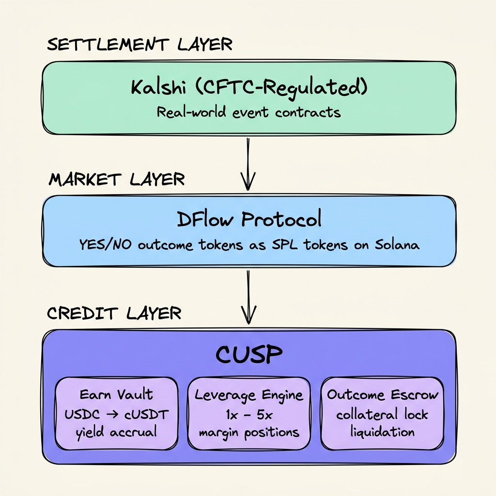
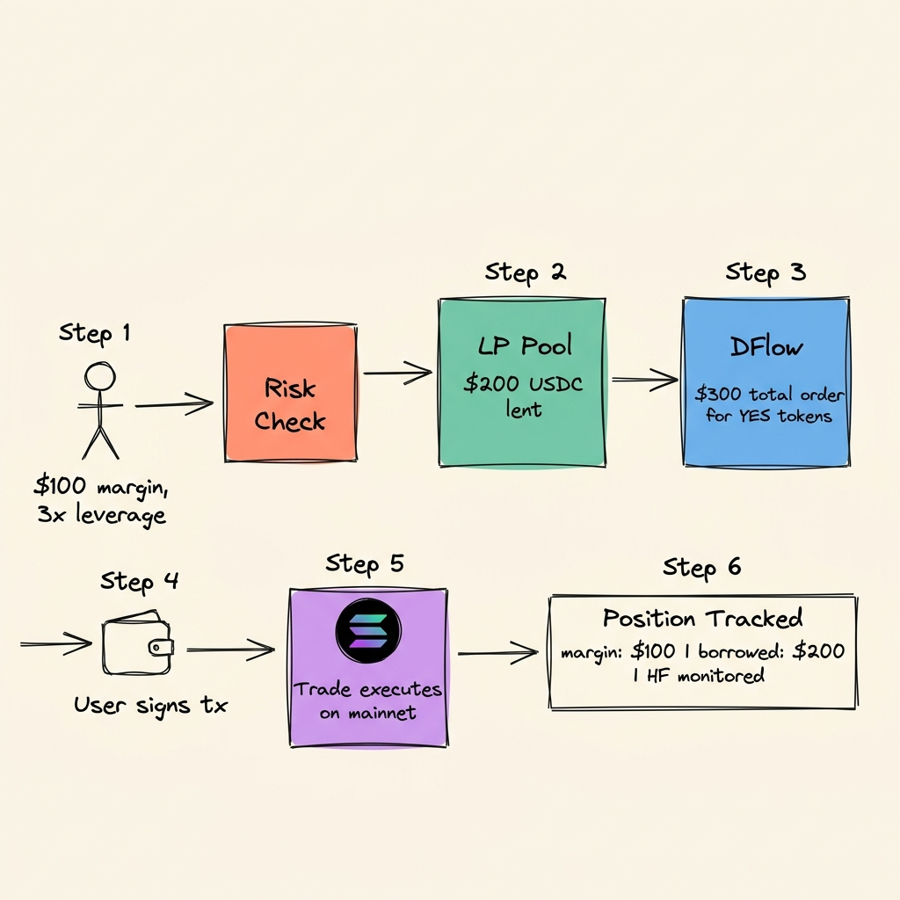

<p align="center">
  
</p>

<h1 align="center">Cusp</h1>

<p align="center">
  <strong>The credit layer for prediction markets</strong>
</p>

<p align="center">
  Borrow against your Kalshi positions. Lend to traders. Leverage up to 5×.<br/>
  On-chain. Non-custodial. Real yield. No token.
</p>

<p align="center">
  <a href="https://cusp.fi">🌐 Live App</a> &nbsp;·&nbsp;
  <a href="#architecture">📐 Architecture</a> &nbsp;·&nbsp;
  <a href="#on-chain-programs">⚙️ Programs</a> &nbsp;·&nbsp;
  <a href="#getting-started">🚀 Run Locally</a>
</p>

<p align="center">
  
  
  
  
</p>

---

## The Problem

Prediction markets are the fastest-growing derivatives category. Kalshi alone processes **billions in volume** — and DFlow is bringing those markets on-chain as SPL tokens on Solana.

But there's a massive gap: **prediction market positions have zero capital efficiency.**

When you buy YES on "BTC > $150K," your money is locked until the event resolves. You can't borrow against it. You can't earn yield on the other side. You can't leverage your conviction. In every other corner of DeFi, assets are productive — they collateralize loans, they earn yield, they compose with other protocols. Prediction market positions don't. They just sit there.

> **Cusp is the credit layer that fixes this.**

---

## What Cusp Builds

Cusp is the **credit infrastructure** for prediction market outcome tokens. We bring borrowing, lending, and leverage to an asset class that has never had it.

<table>
<tr>
<td width="33%" valign="top">

### 🏦 Borrow

**Unlock liquidity without selling your position.**

Deposit your YES or NO outcome tokens as collateral and borrow USDC instantly. Up to 50% LTV, capped interest rates, live health factor tracking. Positions auto-close before resolution — binary risk never touches lenders.

→ `/lend`

</td>
<td width="33%" valign="top">

### 💰 Lend

**Earn real yield from prediction market credit.**

Deposit USDC into the Cusp Vault. Earn yield sourced from borrower interest, high-probability outcome farming, and Kamino Earn. No emissions, no governance token — yield comes from actual credit demand.

→ `/vault`

</td>
<td width="33%" valign="top">

### ⚡ Leverage

**Amplify conviction with one click.**

Loop your collateral to turn a position into up to 5× exposure. The protocol borrows from the LP pool, executes the DFlow trade, and tracks the leveraged position — all in a single flow. No manual loops.

→ `/markets/:ticker`

</td>
</tr>
</table>

---

## Why "Credit Layer"?

Every mature financial market has credit infrastructure underneath it. Equities have margin lending. Bonds have repo. Commodities have warehouse financing. Prediction markets have **nothing** — until now.

Cusp provides the three primitives that turn prediction markets from a speculative sideshow into a composable financial system:

<p align="center">
  
</p>

This is **the same stack pattern** that made DeFi lending (Aave/Compound) a $30B+ market — except applied to the fastest-growing derivatives class on earth.

---

## How a Leveraged Trade Works

<p align="center">
  
</p>

> **Example:** User posts $100 margin at 3× → CUSP lends $200 from LP pool → $300 DFlow order for YES tokens → user signs via Phantom → position tracked on-chain with health factor monitoring.

---

<a name="architecture"></a>

## Architecture

The system is a full-stack monorepo: React frontend, Express.js API proxy, Supabase database, and 4 native Rust Solana programs — coordinated to deliver a seamless credit experience on top of DFlow/Kalshi markets.

| Layer | Stack | Role |
|---|---|---|
| **Frontend** | React 18 · Vite · TypeScript · Tailwind · shadcn/ui · Framer Motion · Recharts | Premium trading interface with real-time WebSocket data |
| **API** | Express.js · WebSocket | DFlow key proxy, live orderbooks, leverage trade orchestration, risk engine |
| **Database** | Supabase (PostgreSQL) | Positions, deposits, exchange rate history, trade logs, waitlist |
| **On-Chain** | 4 Native Rust Solana programs | Vault, leverage, collateral escrow — fully non-custodial |
| **Integrations** | DFlow · Kalshi · Kamino · Jupiter | Market data, trade execution, yield strategy, token swaps |

| Deployment | Platform |
|---|---|
| Frontend + Serverless | Vercel |
| Backend API | Railway (Docker) |
| Database | Supabase |
| RPC | QuickNode (devnet + mainnet) |
| Programs | Solana mainnet-beta + devnet |

---

<a name="on-chain-programs"></a>

## On-Chain Programs

All four programs are **Native Rust** — no Anchor framework. Custom PDA derivation, manual account deserialization, optimized binary layout. This is intentional: prediction market credit requires tight control over account structure and instruction flow.

---

### `cusp-earn-vault`
**`Bs53nqkzB4x81giq2Vc8SC6NLK7euxWThkcuj3UVZZcp`**

The yield-bearing lending pool. Users deposit USDC, receive cUSDT — a receipt token that appreciates as credit revenue flows in.

```
Exchange Rate = total_usdc_balance / total_cusdt_supply

As borrowers pay interest → USDC balance grows → cUSDT goes up → lenders earn.
```

| Instruction | What happens |
|---|---|
| `deposit` | User transfers USDC → vault mints cUSDT at current rate |
| `withdraw` | User burns cUSDT → vault returns USDC at current rate |
| `sync_yield` | Admin syncs actual USDC balance from yield sources → rate appreciates |
| `update_kamino_apy` | Update Kamino strategy APY on-chain |
| `set_paused` / `set_performance_fee` | Admin controls |

**Yield sources:** Kamino Earn (Steakhouse USDC) · borrower interest · position farming · close fees.

---

### `cusp-leverage`
**`HTPcC7PNEGG3w6Tj5VSR9HQTQhELqqQRxKTiWkDUm6uF`**

The margin system. Manages the full lifecycle of leveraged prediction market positions: open → fill → close/liquidate.

| Instruction | What happens |
|---|---|
| `open_position` | User posts margin USDC → PDA position + escrow created, borrowed amount calculated |
| `fill_position` | Admin records outcome tokens + entry price after DFlow trade execution |
| `close_position` | Position settled: borrowed amount repaid, profit returned to user |
| `liquidate` | Permissionless — anyone can trigger when position value drops below 80% of debt |

**Liquidation mechanics:** `position_value < borrowed × 0.80` → liquidatable. Margin is forfeit, protocol recovers loan.

---

### `cusp-outcome-escrow`

Collateral custody for the lending system. Holds YES/NO outcome tokens in PDA-owned vaults, with separate admin and liquidation authority roles.

| Instruction | What happens |
|---|---|
| `deposit_collateral` | User locks outcome tokens into escrow vault |
| `release_collateral` | Admin returns tokens when loan is repaid |
| `seize_collateral` | Liquidation authority seizes tokens on default |

---

### `cusp-vault` *(legacy)*

Original devnet vault (cUSDC). Superseded by `cusp-earn-vault` for production.

---

## Risk Parameters

| Parameter | Value | Rationale |
|---|---|---|
| Max LTV | 50% | Outcome tokens are binary — conservative ceiling |
| Safe LTV | 35% | Recommended borrowing level for price swing buffer |
| Liquidation LTV | 60% | Gives borrowers buffer before collateral seizure |
| Max Leverage | 5× | Caps risk for the LP pool |
| Hard Expiry | 7 days | Forces periodic rollover, prevents stale borrows |
| Min Reserve | 20% | LP pool always maintains withdrawal liquidity |
| Max Position/TVL | 8% | Diversification cap per single market |
| Performance Fee | 5% | On vault yield (admin-configurable, max 10%) |

---

## Project Structure

```
cusp-fi/
├── apps/
│   ├── web/                      # React frontend
│   │   └── src/
│   │       ├── pages/            # Landing · Vault · Lend · Markets · MarketDetail · Portfolio
│   │       ├── components/       # MarketTradePanel · BorrowPanel · DepositWithdraw · Navbar
│   │       ├── hooks/            # 29 custom hooks (useLeveragedTrade, useDflowMarkets, etc.)
│   │       └── lib/              # dflow-api · solana · earn-vault · wallet · network-config
│   └── api/                      # Express.js backend
│       └── src/
│           ├── routes/           # dflow · leverage-trade · outcome-lending · risk · vault
│           ├── ws/               # DFlow WebSocket relay
│           └── solana/           # On-chain interaction helpers
│
├── programs/                     # Solana programs (Native Rust)
│   ├── cusp-earn-vault/          # Yield vault (mainnet) — 610 lines
│   ├── cusp-leverage/            # Leveraged positions — 600 lines
│   ├── cusp-outcome-escrow/      # Collateral custody — 540 lines
│   └── cusp-vault/               # Legacy devnet vault
│
├── supabase/                     # Database migrations + edge functions
├── packages/                     # Shared workspace packages
├── pnpm-workspace.yaml           # Monorepo config
└── turbo.json                    # Turborepo pipeline
```

---

## Features

**Trading**
- Live DFlow market trading with real-time WebSocket orderbooks
- Candlestick charts (1D / 1W / 1M / 3M / 1Y)
- Buy YES or NO with leverage (1×–5×) in a single flow
- Multi-outcome event tables with per-outcome trading
- Live price flash animations + WebSocket freshness indicators

**Credit**
- Borrow USDC against YES/NO outcome tokens
- Live health factor monitoring with liquidation alerts
- 7-day hard expiry with automatic position close
- LP-funded leverage with server-side lending

**Vault**
- Deposit USDC, receive yield-bearing cUSDT
- Exchange rate chart with historical snapshots
- Four yield sources (Kamino, farming, borrow fees, close fees)
- Reserve ratio + deployed ratio transparency

**Portfolio**
- Unified dashboard: positions, holdings, deposits, P&L
- On-chain outcome token sync (no manual tracking)
- Collateral position visibility

**UX**
- QVAC — AI-powered command palette (⌘K)
- Phantom + Solflare wallet support
- Seamless devnet ↔ mainnet via `VITE_PHASE`
- Framer Motion micro-animations throughout

---

## Cusp vs. The Status Quo

| | Prediction Markets Today | With Cusp |
|---|---|---|
| **Capital efficiency** | Positions are dead capital until resolution | Collateralize, borrow against, leverage |
| **Yield** | None — or token emission ponzinomics | Real yield: borrower interest + credit spread |
| **Leverage** | Not possible | Up to 5× in one click |
| **Composability** | Siloed platforms, no DeFi interop | On-chain SPL tokens, fully composable |
| **Regulatory basis** | Offshore, unregulated | Kalshi (CFTC-regulated) via DFlow |
| **Custody** | Centralized | Non-custodial Solana programs |
| **Credit market** | Doesn't exist | Cusp IS the credit market |

---

<a name="getting-started"></a>

## Getting Started

### Prerequisites

- **Node.js** ≥ 18 + **pnpm**
- **Solana CLI** — `curl -fsSL https://www.solana.new/setup.sh | bash`
- **Rust** (for program development)

### Install & Run

```bash
# Clone
git clone https://github.com/Adityaakr/cusp-fi.git
cd cusp-fi

# Install dependencies
pnpm install

# Start frontend + API
pnpm dev
```

Frontend: `http://localhost:5173` · API: `http://localhost:4000`

### Environment

```bash
cp .env.example .env
```

| Variable | Description |
|---|---|
| `VITE_PHASE` | `testnet` (devnet) or `production` (mainnet) |
| `VITE_SUPABASE_URL` | Supabase project URL |
| `VITE_SUPABASE_ANON_KEY` | Supabase anonymous key |
| `DFLOW_API_KEY` | DFlow API key (server-side only, never `VITE_` prefixed) |
| `VITE_MAINNET_RPC_URL` | QuickNode mainnet RPC |
| `VITE_EARN_VAULT_PROGRAM_ID` | Earn vault program address |

### Build Programs

```bash
cd programs
cargo build-sbf --release
```

---

## Tech Stack

| | Technology |
|---|---|
| **Languages** | TypeScript · Rust |
| **Frontend** | React 18 · Vite · Tailwind CSS · shadcn/ui |
| **Motion** | Framer Motion |
| **Charts** | Recharts |
| **Data** | TanStack React Query |
| **Wallets** | `@solana/wallet-adapter` — Phantom + Solflare |
| **Backend** | Express.js · WebSocket (`ws`) |
| **Database** | Supabase (PostgreSQL) |
| **Blockchain** | Solana — 4 Native Rust programs (no Anchor) |
| **RPC** | QuickNode |
| **Yield** | Kamino Finance (Steakhouse USDC) |
| **Swaps** | Jupiter |
| **Monorepo** | pnpm workspaces + Turborepo |

---

## Backed By

<p align="center">
  <a href="https://x.com/SuperteamIN"></a>
  &nbsp;&nbsp;
  <strong>Superteam India</strong>
  &nbsp;&nbsp;&nbsp;&nbsp;&nbsp;&nbsp;
  <a href="https://dflow.net"></a>
</p>

---

## Team

Built by prediction market and DeFi researchers. We believe regulated event markets will become one of the largest derivatives categories on earth — and their most productive form is on-chain: composable, non-custodial, and capital efficient.

Cusp is the credit layer underneath that future.

**Hiring founding engineers →** [contact@cusp.fi](mailto:contact@cusp.fi)

---

<p align="center">
  <sub>No token. No emissions. Just credit.</sub>
</p>
