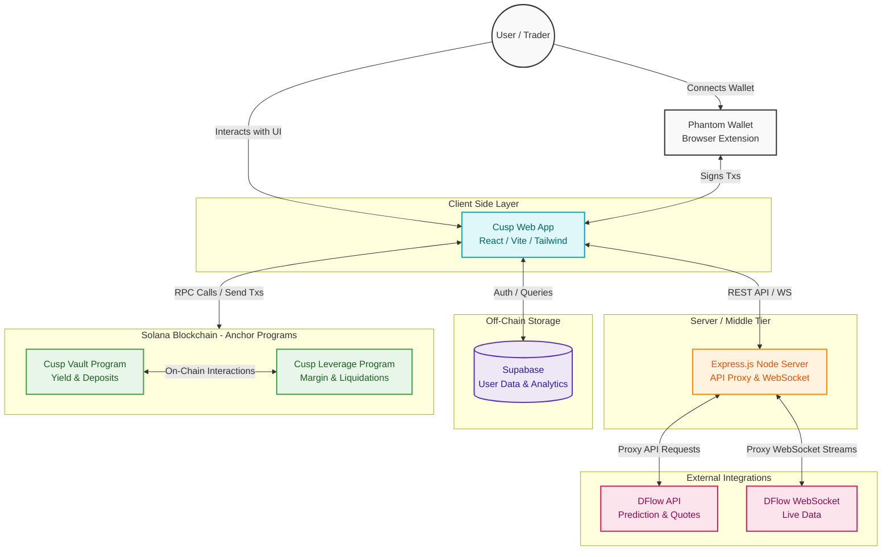

# CUSP Protocol Architecture Design

This document outlines the high-level architecture and data flow for the CUSP protocol, an advanced DeFi layer running on Solana. It breaks down the interaction between the frontend client, proxy server, off-chain storage, third-party integrations, and the core Solana smart contracts.

## System Overview Diagram

Below is the architectural flow representing the interactions between all moving parts in the ecosystem. 

## Component Breakdown & Data Flow

### 1. Client-Side Layer (Frontend)
- **Tech Stack:** React 18, Vite, TypeScript, Tailwind CSS, shadcn-ui.
- **Role:** Delivers a highly responsive, dynamic, and premium user interface. 
- **Data Flow:** 
  - Manages wallet connections and signs transactions via `@phantom/react-sdk`.
  - Fetches real-time market data through the Node Proxy using React Query (`@tanstack/react-query`).
  - Visualizes complex DeFi data and vault states using Recharts and Framer Motion for micro-animations.

### 2. Middle Tier (Node.js Proxy Server)
- **Tech Stack:** Express.js, `ws` (WebSocket).
- **Role:** Acts as a secure, low-latency proxy to interact with DFlow's infrastructure.
- **Data Flow:** 
  - Intercepts requests to `/api/dflow` and `/api/dflow-trade` to inject secure API keys (`DFLOW_API_KEY`) before forwarding them to DFlow's prediction markets and quote endpoints.
  - Manages persistent WebSocket connections (`/ws/dflow`) to stream live market data directly to the React frontend without exposing sensitive credentials.

### 3. External Integrations (DFlow)
- **Role:** Provides the underlying liquidity, order flow, and prediction market data.
- **Data Flow:** Feeds real-time pricing and quote data into the Cusp Protocol, ensuring the frontend has accurate, up-to-the-millisecond data for trading and leverage calculations.

### 4. Off-Chain Storage (Supabase)
- **Tech Stack:** PostgreSQL (via `@supabase/supabase-js`).
- **Role:** Serves as the robust off-chain database.
- **Data Flow:** Handles user preferences, application state that doesn't need to be decentralized, and complex analytics indexing that would be too expensive to compute directly on-chain.

### 5. On-Chain Solana Programs (Anchor)
- **Tech Stack:** Rust, Anchor Framework, Solana Web3.js.
- **Cusp Vault Program (`cusp-vault`):** 
  - Manages secure user deposits and token staking.
  - Orchestrates yield generation strategies securely on the blockchain.
- **Cusp Leverage Program (`cusp-leverage`):** 
  - Handles the complex logic for margin trading.
  - Continuously calculates health factors for open positions and executes liquidations when margin requirements are breached.
- **Data Flow:** The frontend interacts directly with these programs via Solana RPC nodes, building and sending signed transactions that mutate the blockchain state.
